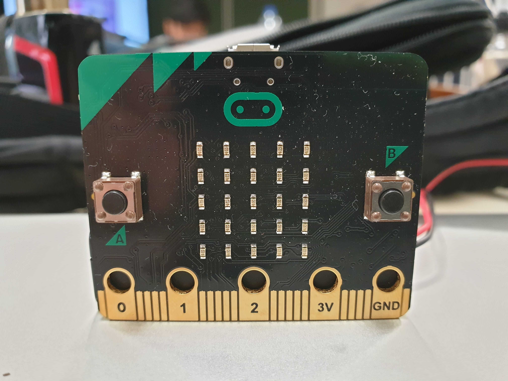
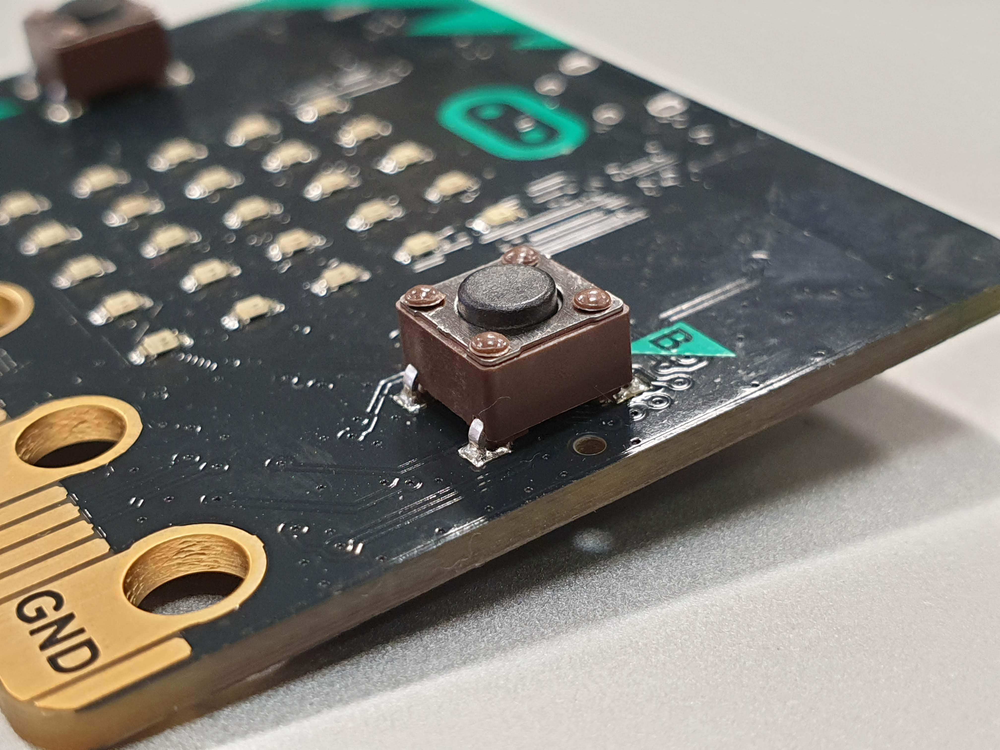
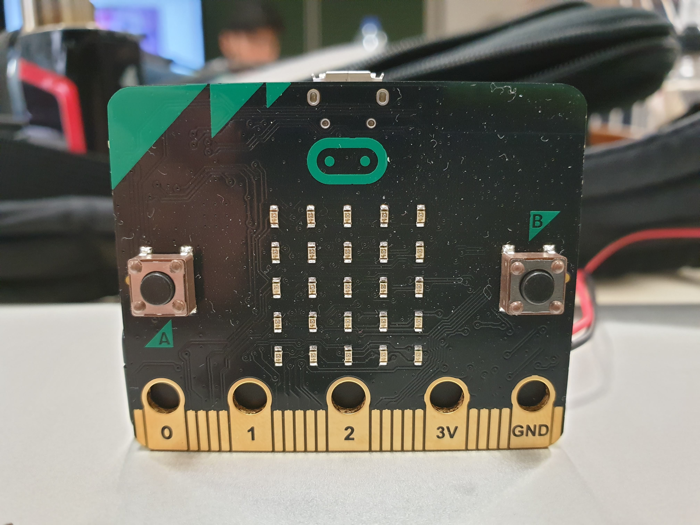
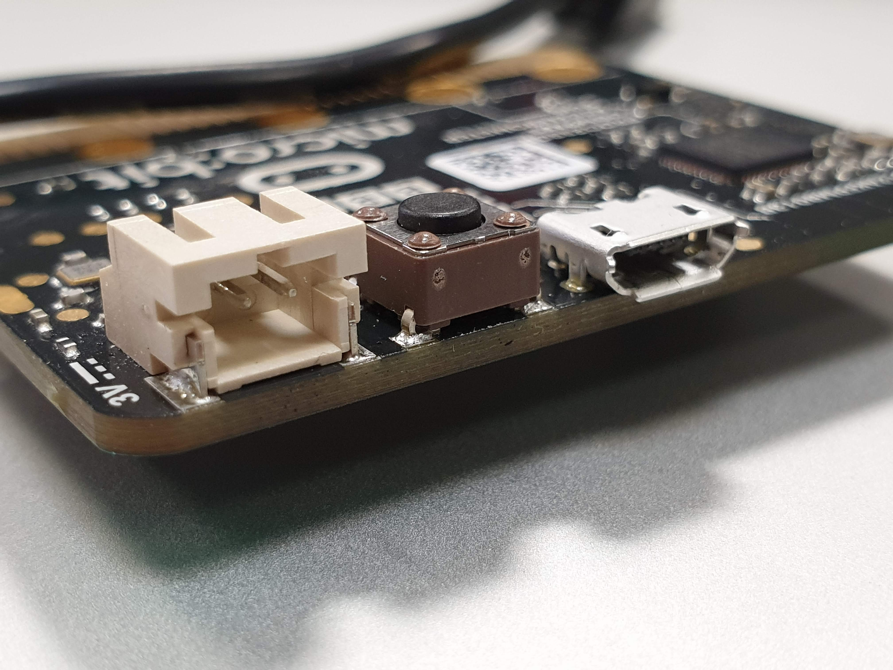

<h1>De BBC Micro:bit</h1>

Sinds 2016 is de Micro:bit, ontwikkeld door de BBC, online verkrijgbaar. Wij lichten graag kort even toe wat de Micro:bit is en wat we ermee kunnen doen.

De kaart is uitermate geschikt voor het programmeren van wearables, mobiele toepassingen ... Kortom voor IoT development. 

In de eerste plaats werd de kaart ontwikkeld om programmeren bij kinderen te stimuleren. Deze indicatie vinden we ook al terug wanneer we kijken naar het ontwerp. De kleuren zorgen voor een toegankelijk design voor kinderen. De verschillende elementen op de kaart zouden een gezichtje moeten voorstellen.

Om de veiligheid van het device te waarborgen werd gekozen voor een externe batterijhouder die de kaart voedt.

**specificaties**
- 52 x 42 mm microcontroller-board
- bedoeld voor draadloze toepassingen
- Nordic nRF51822 ARM Cortex-M0 microcontroller met geïntegreerde Bluetooth Low Energy (BLE) interface (componentenzijde)
- een 3D-versnellingsopnemer (NXP MMA 8652) (componentenzijde)
- een 3D-magnetometer (NXP MAG 3110) (componentenzijde)
- een uitbreidingsconnector (componentenzijde)
- Op de andere kant vinden we een 5 x 5 LED-matrix en twee drukknoppen
- mogelijkheid om met drag-and-drop te programmeren, via usb en OTA (Over The Air) dankzij de Bluetooth-interface

 

**De micro:bit bevat 3 knopjes: 2 die aanspreekbaar zijn in de code (A en B), en achteraan een reset button.**
****
****

<h1>De micro:bits gebruiken als lichtsensoren (via Raspberry Pi)</h1>

**1..** Eerst en vooral willen we graag de bluetooth communicatie mogelijk maken tussen beide apparaten.
   De bluetooth in werking zetten op de Raspberry Pi kunnen we eenvoudig doen door BlueZ te installeren. Dit is de bluetooth stack voor linux. Hierna kan bluetooth gebruikt worden op je Pi.

**2..** Om de Micro:bit te koppelen via bluetooth maken we best gebruik van "passkey pairing". We installeren een hex file waarin we passkey pairing activeren. Dit proces is compleet wanneer we de 6 cijfers invoeren die getoond worden op de display van de Micro:bit

**3..** We kunnen nu de data van onze sensoren gaan monitoren en via de raspberry pi gaan verwerken.
   Zo kunnen we in javascript code schrijven die de invoer van de lichtsensor op de micro:bit kan evalueren en door enkele voorwaarden signalen via bluetooth naar de raspberry pi stuurt.

   **Dit script kan op de micro:bit zelfstandig draaien waardoor meerdere micro:bits tegelijk dit script draaien en is het makkelijk om extra micro:bits toe te voegen en/of verwijderen uit het systeem. Na het ontvangen van bepaalde signalen van de micro:bit(s) kan de raspberry pi deze gebruiken om bepaalde output te genereren.**

   **Dit kan in de vorm van bijvoorbeeld een log bijhouden, een melding naar de administrator sturen, visuele signalen terugsturen naar desbetreffende micro:bit ...**

<h1>De Micro:bit gebruiken als tracker voor je huisdier</h1>

   De micro:bit sensoren voorzien ook de mogelijkheid om oriëntatie en beweging te registreren.
   Dit deed ons denken in de richting van een tracker voor huisdieren.

<h4>Aanpak</h4>

**1..** Als eerste maken we een oneindige loop aan, daar binnen zal alle code voor de tracking zich bevinden.

**2..** Vervolgens maken we 3 variabelen aan die de waarden van de accelerometer bijhouden.

   <h4>Declaring the variables that will hold the changes in movement</h4>

         Xdirection
         Ydirection 
         Zdirection 
   

**3..** Hierna zorgen we ervoor dat de variabelen de waarden bevatten conform de beweging van de accelerometer.
   De code zal er ongeveer uit zien als volgt

   <h4>Variables holding the new coordinates</h4>

         
         set Xdirection to acceleration (mg) X 
         set Ydirection to acceleration (mg) Y 
         set Zdirection to acceleration (mg) Z
   

**4..** Om verandering te registreren zullen we ook data moeten bijhouden die de huidige locatie vastlegt. Deze data wordt dan vergeleken met de nieuwe data. Deze logica kunnen we als volgt uitbouwen.

   <h4>Variables holding the old coordinates</h4>

         Xold
         Yold
         Zold
   

<h4>Logical operation, detect movement</h4>
   
         if Xmovement ≠ OldX ... 
         

**5..** We stellen een threshold in die het programma pas activeert wanneer voldoende beweging wordt geregistreerd

   <h4>Declaring and initiate the threshold variables</h4>

         set Xdirection to 300
         set Ydirection to 300
         set Zdirection to 300

   *Deze waarde kan worden ingesteld naar eigen voorkeur*
         

   Ook hier zullen we een conditie schrijven die kijkt of de waarde van de treshold wordt overschreden
   (opnieuw gebruik van if statement)

**6..** Vervolgens gaan we de bluetooth feature activeren.
   - Onze micro:bit zal communiceren via een Android smartphone.  
   - Communicatie via 'Bluetooth Eddystone URL'  
   - Principe is dat de applicatie op ieder moment in staat is om de micro:bit te tracken volgens deze 'Bluetooth Eddystone URL'  
   

**Deze techniek kan voor verscheidene vormen van output zorgen:**

**De periodes waarin geen beweging gedetecteerd werd loggen om te zien wanneer je huisdier slaapt of rust.**

**De microbit bevestigen aan de voederbak waardoor wanneer het dier eet, de kleinste beweging van de bak gedetecteerd wordt en een melding stuurt naar de user.**

**Een goede manier hiervoor lijkt mij het gebruik van IFTTT, hierbij kan vanuit python een http-request naar de Webhooks-service van IFTTT gestuurd worden, die dan op zijn beurt een android melding, een email of een sms kan sturen naar de user.</li>**
