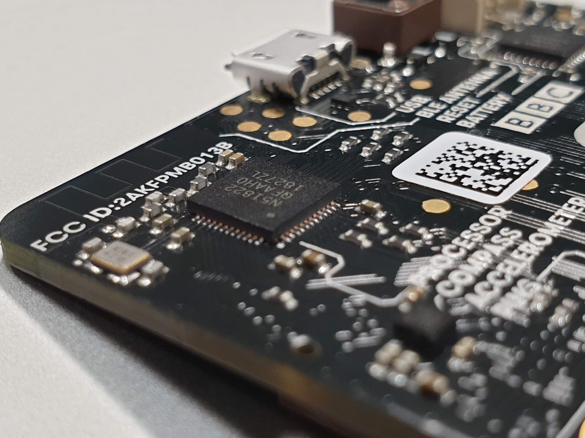

<h1>Onderzoek BBC Micro:bit</h1> 

<h2>Introductie</h2>
In dit onderzoeksrapport worden de mogelijkheden van de BBC Micro:Bit bekeken. Ook wordt onderzocht in welke mate deze kan samenwerken met de Raspberry Pi door middel van enkele voorbeelden. Bij het unboxen werd al meteen duidelijk dat de Micro:Bit eerder bestemd is voor kinderen en/of beginnende programmeurs, verder bleek ook het programmeren voor en uitvoeren op de Micro:Bit relatief simpel. De moeilijkheid was het gebruik van de Micro:Bit samen met de Raspberry Pi.

<h2>De BBC Micro:bit</h2>

Sinds 2016 is de Micro:bit, ontwikkeld door de BBC, online verkrijgbaar. Wij lichten graag kort even toe wat de Micro:bit is en wat we ermee kunnen doen.

De kaart is uitermate geschikt voor het programmeren van wearables, mobiele toepassingen ... Kortom voor IoT development. 

In de eerste plaats werd de kaart ontwikkeld om programmeren bij kinderen te stimuleren. Deze indicatie vinden we ook al terug wanneer we kijken naar het ontwerp. De kleuren zorgen voor een toegankelijk design voor kinderen. De verschillende elementen op de kaart zouden een gezichtje moeten voorstellen.

Code voor de Micro:bit kan geschreven worden in onder andere Javascript en Python, maar deze worden eerst omgezet naar MicroPython vooraleer de Micro:Bit deze kan uitvoeren. 

Stroomvoorziening werd met belang voor veiligheid ontwikkeld.
De micro:bit kan op 2 manieren van stroom worden voorzien:

1.. **Micro-USB** 
Een simpele USB-A naar Micro-USB kabel kan de micro:bit van stroom voorzien, dit sluit je best aan op een standaard 5V USB poort van je computer. Hiermee kan je ook makkelijk je nieuwe of aangepaste code installeren op de micro:bit.

2.. **Batterij** 
Wanneer de code moet gedraaid worden op batterij kan dit perfect met 2 zink of alkaline batterijen van type AAA. Wanneer de batterij is aangesloten wanneer een Micro-USB kabel wordt aangesloten, dan zal de micro:bit automatisch overschakelen op de USB-stroom.

**Overige Specificaties**
- 52 x 42 mm microcontroller-board
- Bedoeld voor draadloze toepassingen
- Nordic nRF51822 ARM Cortex-M0 microcontroller met geïntegreerde Bluetooth Low Energy (BLE) interface (componentenzijde)
- 3D-versnellingsopnemer (NXP MMA 8652) (componentenzijde)
- 3D-magnetometer (NXP MAG 3110) (componentenzijde)
- Uitbreidingsconnector (componentenzijde)
- Op de andere kant vinden we een 5 x 5 LED-matrix en twee drukknoppen
- Mogelijkheid om met drag-and-drop te programmeren, via usb en OTA (Over The Air) dankzij de Bluetooth-interface

 

** De processor van de Micro:Bit  **
** Voorkant van de Micro:Bit waar je de 2 buttons en leds kan zien  **
** De batterij aansluiting, de reset button en de micro-usb aansluiting **

 

<h2>De micro:bits gebruiken als lichtsensoren (via Raspberry Pi)</h2>

**1..** Eerst en vooral willen we graag de bluetooth communicatie mogelijk maken tussen beide apparaten.
   De bluetooth in werking zetten op de Raspberry Pi kunnen we eenvoudig doen door BlueZ te installeren. Dit is de bluetooth stack voor linux. Hierna kan bluetooth gebruikt worden op je Pi.

**2..** Om de Micro:bit te koppelen via bluetooth maken we best gebruik van "passkey pairing". We installeren een hex file waarin we passkey pairing activeren. Dit proces is compleet wanneer we de 6 cijfers invoeren die getoond worden op de display van de Micro:bit

**3..** We kunnen nu de data van onze sensoren gaan monitoren en via de raspberry pi gaan verwerken.
   Zo kunnen we in javascript code schrijven die de invoer van de lichtsensor op de micro:bit kan evalueren en door enkele voorwaarden signalen via bluetooth naar de raspberry pi stuurt.

   **Dit script kan op de micro:bit zelfstandig draaien waardoor meerdere micro:bits tegelijk dit script draaien. Bovendien is het makkelijk om extra micro:bits toe te voegen en/of te verwijderen uit het systeem. Na het ontvangen van bepaalde signalen van de micro:bit(s) kan de raspberry pi deze gebruiken om bepaalde output te genereren.**

   **Dit kan in de vorm van bijvoorbeeld een log bijhouden, een melding naar de administrator sturen, visuele signalen terugsturen naar desbetreffende micro:bit ...**

<h4>Setup</h4>

**1.. Dependencies installeren** 
Eerst en vooral moet bluezero worden geinstalleerd, dit kan eenvoudig door volgend commando:

    sudo pip3 install bluezero
    sudo reboot

**2.. Bluetooth instellen** 
Met volgende commando activeer je de bluetooth tool:

    sudo bluetoothctl

Nu moet je controleren of de bluezero toestemming heeft om de bluetooth adapter te gebruiken door volgend commando:

    show

Als resultaat krijg je iets gelijkaardig aan dit:

    Controller B8:27:EB:B1:DC:13
            Name: raspberry-arvellon
            Alias: raspberry-arvellon
            Class: 0x480000
            Powered: yes
            Discoverable: no
            Pairable: yes
            UUID: Headset AG                (00001112-0000-1000-8000-00805f9b34fb)
            UUID: Generic Attribute Profile (00001801-0000-1000-8000-00805f9b34fb)
            UUID: A/V Remote Control        (0000110e-0000-1000-8000-00805f9b34fb)
            UUID: Generic Access Profile    (00001800-0000-1000-8000-00805f9b34fb)
            UUID: PnP Information           (00001200-0000-1000-8000-00805f9b34fb)
            UUID: A/V Remote Control Target (0000110c-0000-1000-8000-00805f9b34fb)
            UUID: Audio Source              (0000110a-0000-1000-8000-00805f9b34fb)
            UUID: Handsfree Audio Gateway   (0000111f-0000-1000-8000-00805f9b34fb)
            Modalias: usb:v1D6Bp0246d052B
            Discovering: no

Indien er 'Powered: yes' staat is alles in orde anders moet je eesrst nog de adapter activeren:

    power on

Normaal zou dit commando de adapter moeten activeren. Hoewel het mogelijk is dat bluezero geen toestemming heeft en dan krijg je volgende error:

    Failed to set power on: org.bluez.Error.Blocked

Dit kan je oplossen door bluezero toestemming te geven:

    exit
    rfkill unblock all

Nu kan je nogmaals proberen om de adapter te activeren:

    power on

En dan kan de de scan starten

    scan on

Wanneer de microbit in de lijst staat dien je het adres te kopieren (heeft volgende structuur: yy:yy:yy:yy:yy:yy)

**3.. De Micro:Bit pairen** 
Nu moeten we de micro:bit pairen aan de raspberry pi door eerst de micro:bit in pairing modus te brengen. Dit gebeurd door beide buttons ingedrukt te houden en kort op de reset button te drukken. Houd de buttons (behalve de reset button) tot het bluetooth logo op de led matrix verschijnt, dan mag je alle buttons los laten. Nu kan je pairen door volgend commando:

    pair yy:yy:yy:yy:yy:yy
    (vervang yy:yy:yy:yy:yy:yy door het gekopieerde adres)

En nu ben je gepaired

 

<h1>De Micro:bit gebruiken als tracker voor je huisdier</h1>

   De micro:bit sensoren voorzien ook de mogelijkheid om oriëntatie en beweging te registreren.
   Dit deed ons denken in de richting van een tracker voor huisdieren.

<h4>Aanpak</h4>

**1..** Als eerste maken we een oneindige loop aan, daar binnen zal alle code voor de tracking zich bevinden.

**2..** Vervolgens maken we 3 variabelen aan die de waarden van de accelerometer bijhouden.

   <h4>Declaring the variables that will hold the changes in movement</h4>

         Xdirection
         Ydirection 
         Zdirection 
   

**3..** Hierna zorgen we ervoor dat de variabelen de waarden bevatten conform de beweging van de accelerometer.
   De code zal er ongeveer uit zien als volgt:

   <h4>Variables holding the new coordinates</h4>

         set Xdirection to acceleration (mg) X 
         set Ydirection to acceleration (mg) Y 
         set Zdirection to acceleration (mg) Z
   

**4..** Om verandering te registreren zullen we ook data moeten bijhouden die de huidige locatie vastlegt. Deze data wordt dan vergeleken met de nieuwe data. Deze logica kunnen we als volgt uitbouwen:

   <h4>Variables holding the old coordinates</h4>

         Xold
         Yold
         Zold
   
<h4>Logical operation, detect movement</h4>
   
         if Xmovement ≠ OldX ... 
         

**5..** We stellen een threshold in die het programma pas activeert wanneer voldoende beweging wordt geregistreerd:

   <h4>Declaring and initiate the threshold variables</h4>

         set Xdirection to 300
         set Ydirection to 300
         set Zdirection to 300

   *Deze waarde kan worden ingesteld naar eigen voorkeur.*
         

   Ook hier zullen we een conditie schrijven die kijkt of de waarde van de treshold wordt overschreden
   (opnieuw gebruik van if statement).

**6..** Vervolgens gaan we de bluetooth feature activeren.
   - Onze micro:bit zal communiceren via een Android smartphone 
   - Communicatie via 'Bluetooth Eddystone URL' 
   - Principe is dat de applicatie op ieder moment in staat is om de micro:bit te tracken volgens deze 'Bluetooth Eddystone URL' 
   

**Deze techniek kan voor verscheidene vormen van output zorgen:**

- De periodes waarin geen beweging gedetecteerd werd, loggen om te zien wanneer je huisdier slaapt of rust.

- De microbit bevestigen aan de voederbak waardoor wanneer het dier eet, de kleinste beweging van de bak gedetecteerd wordt en een melding stuurt naar de user.

**Een goede manier hiervoor lijkt mij het gebruik van IFTTT, hierbij kan vanuit python een http-request naar de Webhooks-service van IFTTT gestuurd worden, die dan op zijn beurt een android melding, een email of een sms kan sturen naar de user.</li>**

 

<h2>Gebruik van micro:bit met smartphone</h2>

**Foto trekken en rear/front camera togglen met micro:bit buttons**

Een andere leuke feature waarvoor we de micro:bit kunnen gebruiken is als remote voor onze smartphone.
Via een druk op de A knop van deze micro:bit kunnen we ons beeld vastleggen. De knop fungeert dan eigenlijk als onze camera trigger button. Ook is het mogelijk om te switchen tussen front en rear camera. In deze code gebruiken we hiervoor de B toets.
Met deze korte code kunnen we dit voor mekaar krijgen.

         input.onButtonPressed(Button.A, function() {
            devices.tellCameraTo(MesCameraEvent.TakePhoto)
         })

         input.onButtonPressed(Button.B, function() {
            devices.tellCameraTo(MesCameraEvent.ToggleFrontRear)
         })

         basic.showString("A=photo B=front-rear")
         

         
**Compass feature met micro:bit**

Als tweede leuke feature kunnen we de micro:bit hanteren om ons te voorzien van de juiste windrichtingen.
We spreken hiervoor de magnetometer aan die standaard aanwezig is in de micro:bit.
Onze code zou er uitzien als volgt.

         let degrees = 0
         bluetooth.startMagnetometerService()
         bluetooth.startLEDService()
         degrees = input.compassHeading()
         basic.showString("COMPASS")
         basic.forever(function () {
            degrees = input.compassHeading()
            if(degrees < 45 || degrees > 315) {
               basic.showString("N")
            } else if (degrees < 135) {
               basic.showString("E")
            }  else if (degrees < 225) {
               basic.showString("S") 
            } else {
               basic.showString("W")
            }
         })

<h2>Besluit</h2>

Met deze laatste toepassing hadden wij graag ons onderzoek afgesloten.
Op basis van voorafgaande voorbeelden en beschrijving van de micro:bit met zijn funcionaliteiten, zou het mogelijk moeten zijn om ermee aan de slag te gaan en alvast toffe dingen te gaan doen. Een kleine voorgeschiedenis in programmeren is een pluspunt. 
We vonden het beiden een interessante en leerrijke ontdekkingstocht. We waren best verbaasd over de mogelijkheden die deze mini chip met zich meebracht. De chip is op zich ook zeer goedkoop te verkrijgen en is dus een mooie instap voor geinteresseerden. 
We hopen dat ook u erdoor geïnspireerd raakt. 
